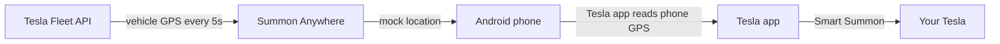

# Summon Anywhere

| Screenshot | Demo |
|------------|------|
|  | https://github.com/user-attachments/assets/8815dfb4-b887-4438-9bd6-ead82a607afe |

**Android-only** Flutter app that extends Tesla Smart Summon range by syncing your phone's mock GPS to your vehicle's real location via the Tesla Fleet API.

```bash
git clone https://github.com/usamasaleem1/summon-anywhere-tesla.git
cd summon-anywhere-tesla
```

Tesla Smart Summon normally requires your phone to be within a short distance of the car. Summon Anywhere polls your vehicle's GPS every 5 seconds and feeds those coordinates to Android's mock location system, so the Tesla app thinks your phone is standing next to the car — even when you're far away.

You still summon in the **official Tesla app**. Pick a destination on the map (not "Come to me"). This app does not drive the car; it only bridges the location gap.

> **Safety:** Smart Summon will not work on public roads. Use responsibly and only where Smart Summon is permitted. You are responsible for your vehicle at all times.

## Why Android only?

This app relies on Android's **mock location** API (Developer options → Select mock location app). iOS does not expose an equivalent API to third-party apps — Apple restricts location spoofing for privacy and security reasons. An iOS version is not feasible without jailbreaking or other workarounds outside the scope of this project.

## How it works



1. **Sync vehicle location** — Every 5 seconds the app fetches your Tesla's real GPS from the Fleet API.
2. **Mock your phone's GPS** — Android mock location locks your phone to the car so Smart Summon thinks you're standing next to it.
3. **Summon in the Tesla app** — Open the Tesla app, choose Smart Summon, and pick a map destination.
4. **5-minute sessions** — Each summon session runs up to 5 minutes with a foreground service to keep location sync reliable.

## Important things to know

- **You need your own Tesla Developer credentials.** This repo does not include API keys. Each builder registers their own OAuth app at [developer.tesla.com](https://developer.tesla.com) and supplies keys locally. Tesla gives you like 10$ worth of credits a month by default, and I you won't even hit that if you summon multiple times a day, every day.
- **Fleet API partner registration may be required.** If you get HTTP 412 errors, complete Tesla's partner account registration for your region.
- **NA region by default.** The app targets the North America Fleet API. EU and other regions require changing `teslaFleetAudience` in `lib/core/services/auth_service.dart`.
- **Developer options required.** You must enable mock location on your Android phone — this is not a normal consumer app install flow.
- **Vehicle must be awake.** If the car is deeply asleep, Fleet API location may be stale or unavailable.
- **Not affiliated with Tesla.** This is an independent open-source project.

---

## Prerequisites (for building)

| Requirement                 | Notes                                                                                                    |
| --------------------------- | -------------------------------------------------------------------------------------------------------- |
| **Android phone**           | Physical device recommended; emulator mock location is unreliable                                        |
| **Developer options**       | Enable on your phone before first use                                                                    |
| **Flutter SDK**             | [Install Flutter](https://docs.flutter.dev/get-started/install) (stable channel)                         |
| **Android SDK + JDK 17**    | Installed via Android Studio or `sdkmanager`                                                             |
| **Tesla Developer account** | [developer.tesla.com](https://developer.tesla.com) with Fleet API access                                 |
| **Google Maps API key**     | [Maps SDK for Android](https://developers.google.com/maps/documentation/android-sdk/get-api-key) enabled |

---

## Part 1: Tesla Developer Portal setup

This is the most important step. Without your own OAuth app, sign-in will fail.

### Step 1 — Create an OAuth application

1. Go to [developer.tesla.com](https://developer.tesla.com) and sign in.
2. Create a new application (or use an existing one).
3. Note your **Client ID** and **Client Secret**.

### Step 2 — Register the redirect URI exactly

Add this redirect URI verbatim in the Tesla portal (scheme, host, and path must match exactly):

```
com.summonanywhere.auth://app/callback
```

This matches `teslaRedirectUri` in `lib/core/services/auth_service.dart` and the intent filter in `android/app/src/main/AndroidManifest.xml`. A typo here causes "Client authentication failed" at sign-in.

### Step 3 — Enable OAuth scopes

Enable all of these scopes:

- `openid`
- `offline_access`
- `user_data`
- `vehicle_device_data`
- `vehicle_cmds`
- `vehicle_location`

### Step 4 — Fleet API region

Default audience (North America):

```
https://fleet-api.prd.na.vn.cloud.tesla.com
```

If your Tesla account is in **Europe or another region**, edit `teslaFleetAudience` in `lib/core/services/auth_service.dart` to your region's Fleet API URL before building.

### Step 5 — Partner registration (if you get HTTP 412)

Fleet API calls may return **412 Precondition Failed** until your partner account is registered for your region. Complete Tesla partner registration in the developer portal. The app shows a clear error when this happens.

---

## Part 2: Configure API keys locally

Never commit real keys. Both config files are gitignored.

### Tesla credentials — `secrets.json`

```bash
cp secrets.json.example secrets.json
```

Edit `secrets.json`:

```json
{
  "TESLA_CLIENT_ID": "your-client-id-from-tesla-portal",
  "TESLA_CLIENT_SECRET": "your-client-secret-from-tesla-portal"
}
```

### Google Maps API key — `android/local.properties`

```bash
cp android/local.properties.example android/local.properties
```

Edit `android/local.properties`:

```properties
sdk.dir=/path/to/Android/sdk
flutter.sdk=/path/to/flutter
GOOGLE_MAPS_API_KEY=your_google_maps_api_key
```

Flutter usually writes `sdk.dir` and `flutter.sdk` automatically when you run `flutter pub get`. You only need to add `GOOGLE_MAPS_API_KEY`.

**Restrict your Maps key** in [Google Cloud Console](https://console.cloud.google.com/):

1. Enable **Maps SDK for Android**.
2. Restrict the key to Android apps with package name `com.summonanywhere`.
3. Add your signing certificate SHA-1 (debug keystore for local builds: run `keytool -list -v -keystore ~/.android/debug.keystore -alias androiddebugkey -storepass android -keypass android`).

---

## Part 3: Build the APK

From the project root:

```bash
# Install dependencies
flutter pub get

# Generate Riverpod code (required after clone)
dart run build_runner build --delete-conflicting-outputs

# Build release APK (Tesla keys injected at compile time)
flutter build apk --release --dart-define-from-file=secrets.json
```

Output:

```
build/app/outputs/apk/release/app-release.apk
```

For development on a connected phone:

```bash
flutter run --dart-define-from-file=secrets.json
```

**Common build mistake:** Forgetting `--dart-define-from-file=secrets.json` leaves placeholder Tesla keys and sign-in will fail.

Release builds currently sign with the **debug keystore** (see `android/app/build.gradle.kts`). That is fine for sideloading to your own phone. Configure a release keystore separately if you plan Play Store distribution.

### VS Code / Cursor launch config (optional)

Create `.vscode/launch.json`:

```json
{
  "version": "0.2.0",
  "configurations": [
    {
      "name": "Summon Anywhere",
      "request": "launch",
      "type": "dart",
      "toolArgs": ["--dart-define-from-file=secrets.json"]
    }
  ]
}
```

---

## Part 4: Install on your Android phone

### Option A — USB install (easiest during development)

1. Enable **Developer options** and **USB debugging** on your phone.
2. Connect via USB.
3. Run `flutter run --dart-define-from-file=secrets.json` — Flutter installs directly.

### Option B — Sideload the APK

1. Copy `app-release.apk` to your phone (AirDrop alternative: USB, cloud storage, email, etc.).
2. On your phone, enable **Install unknown apps** for the app you use to open the APK (Files, Chrome, etc.).
3. Tap the APK and install.
4. When the app opens, grant **location permissions** (including background location if prompted).

---

## Part 5: First-run setup (in-app onboarding)

The app walks you through three steps on first launch:

### 1. Sign in with Tesla

Tap **Sign in with Tesla**. OAuth opens in the browser; tokens are stored securely on your device via Android Keystore. Your Tesla password is never stored by this app.

### 2. Set mock location app

1. Open **Settings → Developer options** on your phone.
   - If Developer options is hidden: **Settings → About phone → tap Build number 7 times**.
2. Find **Select mock location app** (wording varies by manufacturer).
3. Choose **Summon Anywhere**.

Without this step, summon sessions will fail silently or show errors.

### 3. Battery optimization (recommended)

Disable battery optimization for Summon Anywhere so Android does not kill the foreground service during a 5-minute session. The app links you to the right settings screen.

---

## Part 6: Using the app

1. **Park** your Tesla and open Summon Anywhere. Confirm your vehicle appears on the map.
2. Tap **SUMMON** — a 5-minute foreground session starts; your phone's GPS is synced to the car.
3. Open the **Tesla app** → **Smart Summon** → pick a **destination on the map**.
   - Do **not** tap "Come to me" — your phone already appears next to the car.
4. When finished, tap **SUMMON** again in Summon Anywhere (or wait for the timer) to stop the session.

Tap **How does it work?** on the home screen for an in-app explainer.

---

## Troubleshooting

| Symptom                              | Likely cause                                    | Fix                                                                             |
| ------------------------------------ | ----------------------------------------------- | ------------------------------------------------------------------------------- |
| OAuth "Client authentication failed" | Wrong client ID/secret or redirect URI mismatch | Check `secrets.json` and Tesla portal redirect URI                              |
| Fleet API **412**                    | Partner registration incomplete                 | Complete Tesla partner registration for your region                             |
| Blank or grey map                    | Missing/invalid Maps key                        | Set `GOOGLE_MAPS_API_KEY` in `local.properties`; check API restrictions         |
| Sign-in works but no vehicle on map  | Vehicle asleep or wrong Fleet region            | Wake vehicle; verify `teslaFleetAudience` matches your region                   |
| Summon fails in Tesla app            | Mock location not set                           | Settings → Developer options → Select mock location app → Summon Anywhere       |
| Session stops early                  | Battery optimization                            | Disable battery optimization for Summon Anywhere                                |
| Build succeeds but sign-in fails     | Missing `--dart-define-from-file`               | Rebuild with `flutter build apk --release --dart-define-from-file=secrets.json` |
| "Placeholder" warning at startup     | Tesla keys not injected                         | Create `secrets.json` from example and pass it at build/run time                |

---

## Project structure (for contributors)

| Path                                               | Purpose                                      |
| -------------------------------------------------- | -------------------------------------------- |
| `lib/core/services/auth_service.dart`              | Tesla OAuth config and token exchange        |
| `lib/core/services/tesla_api_service.dart`         | Fleet API client                             |
| `lib/features/background/summon_task_handler.dart` | 5-second GPS polling + mock location updates |
| `android/.../MockLocationHandler.kt`               | Native Android mock location provider        |

---

## License

MIT — see [LICENSE](LICENSE).
